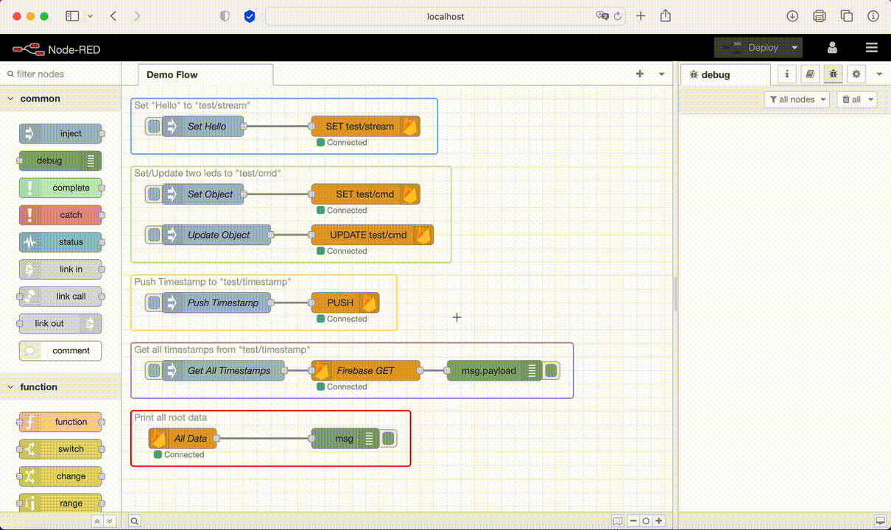

# node-red-contrib-firebase-realtime-database

Node RED nodes to communicate with [Firebase Realtime Databases](https://firebase.google.com/).



## What is it?

This package is used to communicate with Firebase Realtime Databases.
It allows to add, modify and fetch data from your databases aswell as subscribing to data at the paths you specify which yields a `payload` whenever a value changes.

## The Nodes


There are 3 nodes included with this contrib:

| Node         | Purpose                                                                                               |
| ------------ | ----------------------------------------------------------------------------------------------------- |
| Firebase in  | Subscribes to data at the specified path,<br /> which yields a `payload` whenever a value changes.    |
| Firebase get | Fetches data from the specified path.<br />Query constraints can be used to sort and order your data. |
| Firebase out | `SET`, `PUSH`, `UPDATE`, `REMOVE`, `SET PRIORITY` or `SET WITH PRIORITY` data at the target Database. |

On the video above, we can see the "Query Constraint" feature, which is used to sort and order your data as required, and also shown is the "Drag and drop JSON file" feature, which automatically populates the fields with the content of the JSON file you provide.

## How to use?

- From Manage Palette

Find this package `@gogovega/node-red-contrib-firebase-realtime-database` and click install.

- Install Manually  
  Rememeber to restart Node RED after using this method.  
  `.node-red` is usually relative to the users home directory that is running Node RED.

```bash
cd ~/.node-red
npm install @gogovega/node-red-contrib-firebase-realtime-database
```

## Authentication Methods

- `Anonymous`
- `Email`
- `Private Key` (Firebase Admin Node.js SDK)

Read more about the different ways to authenticate [here](./docs/Authentication.md).

## Future Features

- Sign in with Custom Token

## Getting Started Link

- [Authentication Methods](./docs/Authentication.md): Which method used to connect?
- [Firebase Site](https://firebase.google.com/): What is Firebase?
- [Change Log](./CHANGELOG.md): whats changed?

## License

MIT License

Copyright (c) 2022-2023 Gauthier Dandele

Permission is hereby granted, free of charge, to any person obtaining a copy
of this software and associated documentation files (the "Software"), to deal
in the Software without restriction, including without limitation the rights
to use, copy, modify, merge, publish, distribute, sublicense, and/or sell
copies of the Software, and to permit persons to whom the Software is
furnished to do so, subject to the following conditions:

The above copyright notice and this permission notice shall be included in all
copies or substantial portions of the Software.

THE SOFTWARE IS PROVIDED "AS IS", WITHOUT WARRANTY OF ANY KIND, EXPRESS OR
IMPLIED, INCLUDING BUT NOT LIMITED TO THE WARRANTIES OF MERCHANTABILITY,
FITNESS FOR A PARTICULAR PURPOSE AND NONINFRINGEMENT. IN NO EVENT SHALL THE
AUTHORS OR COPYRIGHT HOLDERS BE LIABLE FOR ANY CLAIM, DAMAGES OR OTHER
LIABILITY, WHETHER IN AN ACTION OF CONTRACT, TORT OR OTHERWISE, ARISING FROM,
OUT OF OR IN CONNECTION WITH THE SOFTWARE OR THE USE OR OTHER DEALINGS IN THE
SOFTWARE.
